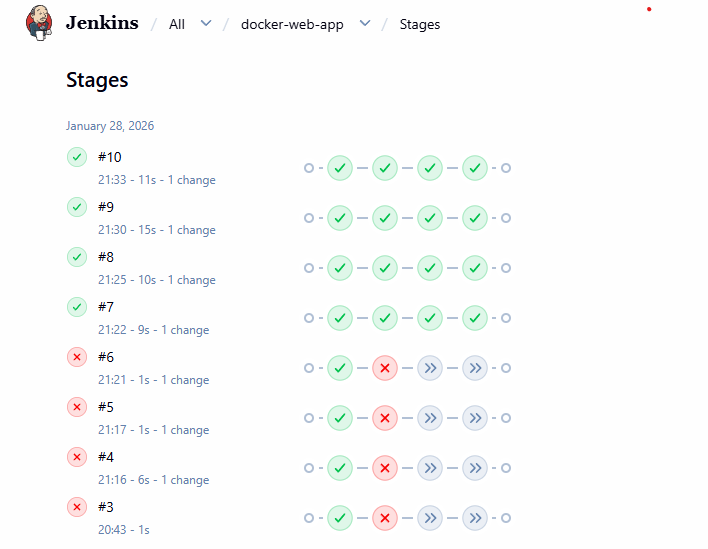

# AWS-Jenkins-Docker CI/CD Pipeline 🚀

A fully automated CI/CD pipeline that deploys a web application to an AWS EC2 instance using Docker containers.

## 🛠 Tech Stack
* **Cloud:** AWS (EC2)
* **CI/CD:** Jenkins
* **Containerization:** Docker
* **SCM:** GitHub (with Webhooks)

## 📋 Pipeline Workflow
1. **Commit:** Developer pushes code to the `main` branch.
2. **Trigger:** GitHub Webhook pings Jenkins.
3. **Build:** Jenkins pulls code and builds a Docker image.
4. **Deploy:** Jenkins stops the old container and runs the new one on Port 80.

## 🚀 How to Run
1. Ensure Docker is installed on your EC2.
2. Add Jenkins to the Docker group: `sudo usermod -aG docker jenkins`.
3. Configure the `Jenkinsfile` with your specific image name.

## 📊 Pipeline Results
The following image demonstrates the automated pipeline flow. After initial configuration and troubleshooting (Builds 3-6), the pipeline achieved 100% stability starting from Build #7.

### Stage Descriptions:
* **Checkout:** Pulls the latest code from the `main` branch.
* **Build Image:** Creates a fresh Docker image based on the `Dockerfile`.
* **Deploy:** Updates the running container on the AWS EC2 instance.
